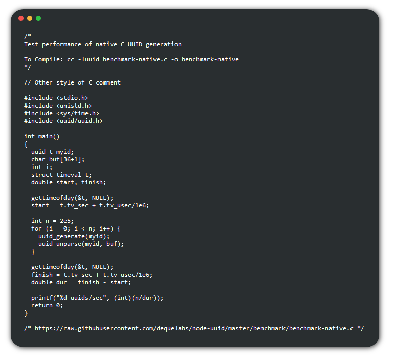
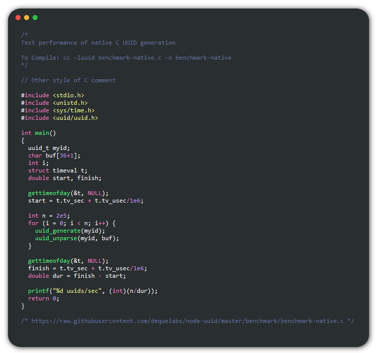

# HTML code block colorizer

A small python utility that can be used to automatically generate colored \<code\> blocks for use in HTML.

The script colors the code according to a list of regular expressions define how to identify specific tokens in the source code.

The color for each token type can then be specified by a separate list mapping each token type to a CSS color.

An example colorizing C code using the [Dracula Theme](https://draculatheme.com/):

Standard \<code\> block:

Dracula Theme:

## Usage

The script takes three file names as input and prints the resulting HTML code to standard out.

`python ./colorizer -f [input_file] -r [rules] -c [color_scheme]`

The input file should be the plain text source code you want to color.

The rules file should contain a mapping between the name of a specific token and the regular expression that defines it. The file should have one rule per line, each rule should have the format:

`TokenName: Rule`

For example:

`Comment: //.*`

Which will match any C style single line comment

The order these rules appear in this file determines their priority. For example if you define the "Comment" rule before the "String" rule any comment that contains a string will be colored like a comment and not like a string.

The color scheme file should contain a list of token names and their associated colors. Separating the rules and color schemes allows for easier switching between themes. The colorscheme file should follow the pattern:

`TokenName: Color`

For example:

`Comment: red`

Which will color every line matching the "Comment" rule defined in the rules file red.